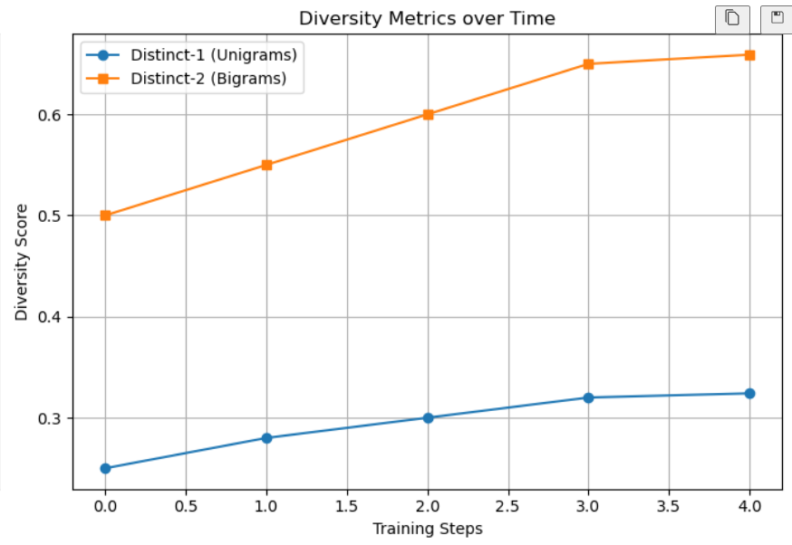

# Creative-Story-Generator# Adaptive Story Generation using Hierarchical Reinforcement Learning

##  Overview

This project explores the use of **Hierarchical Reinforcement Learning (HRL)** to address the complex task of long-form story generation. Traditional generative models often struggle to maintain coherence over extended texts. To overcome this, we decompose the problem into a two-level decision-making process, leveraging RL to guide high-level planning and low-level generation.

The system comprises:

- **Manager (High-Level Policy)**: An LSTM-based RL agent that selects semantic subgoals (story beats) from a predefined space.
- **Worker (Low-Level Policy)**: A language model (GPT-Neo) that generates coherent story segments conditioned on these subgoals.

Training uses the **REINFORCE algorithm** with custom-designed rewards based on relevance, coherence, and diversity.

---

##  Key Features

- **Hierarchical RL formulation**: Manager acts over a coarse action space (subgoals); Worker simulates environment response by generating story text.
- **REINFORCE policy gradient** used for training the Manager on episodic returns.
- **Reward Engineering**: Multi-component reward captures semantic relevance, coherence between segments, and penalizes redundancy.
- **Subgoal Sampling and Optimization**: Manager explores various subgoal paths during training and optimizes over episode-level rewards.
- **Environment Simulation**: The Worker acts as a complex black-box environment in which actions (subgoals) yield textual outcomes.
- **Evaluation** via both automatic metrics (ROUGE) and visualizations of RL learning signals.

---

## Project Files

| File/Folder            | Description                                                                     |
|------------------------|---------------------------------------------------------------------------------|
| `writingPrompts/`      | Contains the WritingPrompts dataset (train, valid, test splits)                 |
| `glove_embeddings/`    | Pretrained GloVe embeddings (e.g., `glove.6B.100d.txt`) for similarity scoring  |
| `images/`              | Contains RL training results                                                    |
| `requirements.txt`     | List of Python dependencies used in this RL framework                           |
| `RL_storytelling.ipynb`| Complete Jupyter Notebook implementing the HRL pipeline                         |
| `report.pdf`           | Final project report detailing architecture, training, and analysis             |

---

##  Training Results (REINFORCE)

The Manager policy was trained using **REINFORCE** to sample subgoal sequences that optimize story quality. Below are diagnostic plots that visualize the RL training dynamics and support key observations.

###  Policy Loss Over Time
The loss remains stable across training, indicating effective learning of subgoal sequences without divergence.


### Cumulative Reward
 Shows a steady linear increase with training episodes, indicating consistent improvement in subgoal quality and story coherence.


###  Reward Curve
Tracks the evolution of reward components—coherence, relevance, and diversity.
Despite variance, the smoothed trend shows a gradual upward trajectory, reflecting steady improvement in generating coherent and relevant storylines.


###  Reward Distribution
Displays distribution of total episodic rewards across training epochs.
Rewards are tightly clustered around 1.30–1.35, indicating consistent story quality with minimal outliers and reliable narrative coherence.


###  Subgoal Diversity
Visualizes how diverse the Manager's subgoal choices are across training, promoting non-redundant storytelling.
Rising Distinct-1 and Distinct-2 scores indicate increasing lexical and structural variety in subgoals, promoting creative and non-repetitive story generation.




---

##  Evaluation Results

After training, the system was evaluated using both automatic metrics and qualitative analysis. Below is a summary of the quantitative results:

| **Metric**                  | **Score** |
|-----------------------------|-----------|
| Average ROUGE-L             | 0.0559    |
| Average BLEU                | 0.0021    |
| Distinct-1 (unigrams)       | 0.3356    |
| Distinct-2 (bigrams)        | 0.6764    |
| Subgoal Diversity Score     | 0.563     |
| Average Episode Reward      | 1.31      |

These results indicate:

- **ROUGE-L** and **BLEU** scores reflect lexical overlap with target summaries, showing room for improvement in n-gram matching.
- **Distinct-n** scores suggest high lexical diversity in generated outputs.
- **Subgoal Diversity** confirms that the Manager avoids repetition and explores varied subgoal trajectories.
- **Average Episode Reward** highlights that reinforcement learning has guided the policy toward increasingly meaningful story plans.


---

##  Conclusion

This project showcases the effectiveness of applying **Hierarchical Reinforcement Learning** to the creative domain of natural language generation. By introducing structured decision-making at the subgoal level, we enhance long-term coherence—something difficult to achieve with end-to-end generation models alone.

Our RL-based Manager learns to guide story flow via interpretable subgoals, allowing reinforcement signals to shape not just language quality but **narrative strategy**.

---

##  Future Work (RL Extensions)

- Integrate **Actor-Critic methods (e.g., A2C, PPO)** for variance reduction and better convergence.
- Replace **heuristic subgoal extraction** with learned embeddings or latent goal networks.
- Model Worker as a **differentiable environment** using simulated returns or rollout-based planning.
- Use ** Diverse human feedback** as reward signal for interactive fine-tuning (RLHF).
- Apply **curriculum learning**: Start with short stories, scale to full narratives as policy matures.


---
---

##  Setup Instructions

>  **Note**: Large files like the dataset and GloVe embeddings are excluded from this repository to avoid GitHub size limits. Please follow the steps below to set up the project locally.

### 1. Download the WritingPrompts Dataset

- Download the dataset from [https://github.com/pkoutavas/StoryDataset](https://github.com/pkoutavas/StoryDataset).
- Place the dataset into a folder named `writingPrompts/` at the root level of this project.

### 2. Download GloVe Embeddings

- Download `glove.6B.zip` from [https://nlp.stanford.edu/data/glove.6B.zip](https://nlp.stanford.edu/data/glove.6B.zip).
- Extract the contents and move the required file (e.g., `glove.6B.100d.txt`) into a folder named `glove.6B/` inside the project directory.

### 3. Install Dependencies

Run the following command in your terminal to install required Python libraries:

```bash
pip install -r requirements.txt
